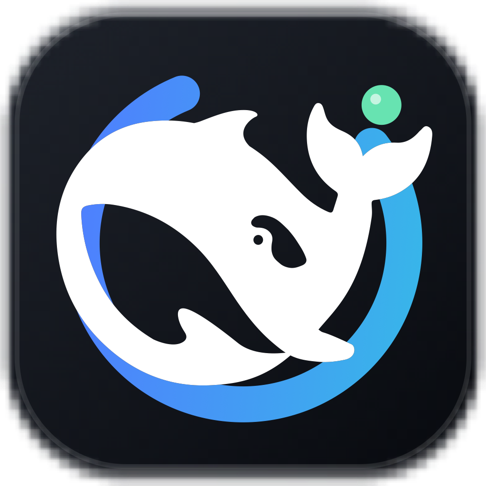

# DSH Desktop

English | [中文](README.zh.md)

<p align="center"></p>

DSH Desktop is an independently maintained macOS desktop application based on the source code of [DeepSeek Harness](https://github.com/deepseek-ai/deepseek-harness). It runs the upstream `dsh web` profile in a hardened Electron window and builds a self-contained unsigned DMG for Apple silicon.

This repository is not an official DeepSeek release. The DeepSeek Harness product name, `@deepseek-ai` package namespace, and existing copyright notices identify the upstream project and remain in the source for attribution and compatibility.

## Developer preview

DSH Desktop is a developer preview and may make compatibility-breaking changes. The current installer supports Apple-silicon macOS only.

## Run

### Build the macOS DMG

Install Node.js `^22.19.0` or `>=24.0.0` and Corepack, then run:

```sh
git clone https://github.com/tangf-ai/dsh-desktop.git
cd dsh-desktop
corepack enable
pnpm install
pnpm desktop:dmg
```

The command writes `apps/desktop/release/DeepSeek-Harness-<version>-arm64.dmg`. The application contains its Node runtime and production dependencies, so the installed application does not require Node, pnpm, or a repository checkout. See the [desktop application reference](apps/desktop/README.md) for installation and verification details.

### Run from source

After installing dependencies, build the repository and start the desktop application:

```sh
pnpm run build
pnpm desktop
```

The desktop application supervises the same local Harness profile, session data, tools, and Web UI as `dsh web`.

## Relationship to DeepSeek Harness

This repository retains the complete DeepSeek Harness monorepo and Git history because `apps/desktop` consumes its workspace packages directly. The desktop-specific source lives under [`apps/desktop`](apps/desktop/README.md); its integration changes keep the existing CLI, Web profile, build, documentation, and runtime dependency graph aligned.

DeepSeek Harness provides the agent harness, CLI, Web UI, plugin architecture, and `@deepseek-ai` packages. DSH Desktop adds Electron process ownership, application assets, macOS packaging, and packaged-application verification without forking the Harness runtime or Web composition.

## Security and limitations

The macOS image has no Developer ID certificate signature and is not notarized. Gatekeeper may require Control-clicking the installed application and choosing Open. The current application uses an operating-system-assigned loopback HTTP/WebSocket port, has no auto-update or crash-reporting service, and does not include Intel macOS or Windows installers. The [desktop application reference](apps/desktop/README.md) documents the renderer security settings and process lifecycle.

## Community and support

- Report DSH Desktop bugs and feature requests in this repository's [GitHub Issues](https://github.com/tangf-ai/dsh-desktop/issues).
- Use the upstream [DeepSeek Harness Discussions](https://github.com/deepseek-ai/deepseek-harness/discussions) for questions about the underlying Harness project.

## Contributing

See [CONTRIBUTING.md](CONTRIBUTING.md).

## Development

Start with the [development guide](docs/development.md) and [architecture documentation](docs/architecture.md). For agents, follow [AGENTS.md](AGENTS.md).

## License

This repository is distributed under the [MIT License](LICENSE). Original DeepSeek Harness code retains the DeepSeek copyright notice, and DSH Desktop modifications are distributed under the same license.

Third-party dependencies and their licenses are disclosed in [THIRD_PARTY_NOTICES.md](THIRD_PARTY_NOTICES.md).
